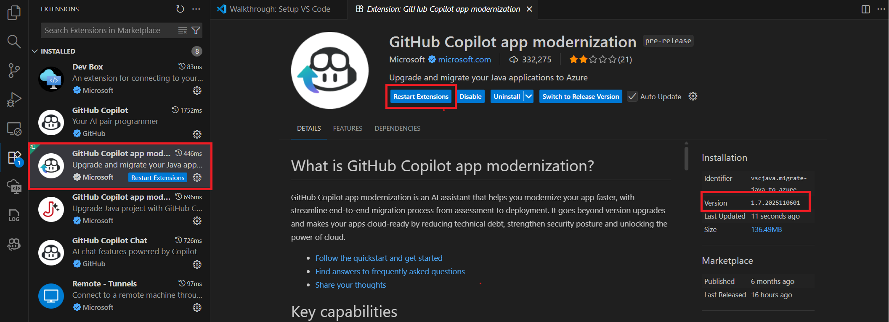

# Convert Semantic Kernel to Agent Framework Workshop

This workshop guides you through the process of migrating Python applications from Microsoft Semantic Kernel to the Microsoft Agent Framework using GitHub Copilot app modernization tools.

## Overview

This repository contains sample applications built with Semantic Kernel that demonstrate AI-powered booking agents. The workshop will show you how to migrate these applications to use the modern Microsoft Agent Framework while maintaining the same functionality.

### Sample Applications

This workshop includes two sample agents:
- **Flight Booking Agent** (`flight-booking-agent/`) - A comprehensive booking system with agent executor and server components
- **Travel Booking Agent** (`travel-booking-agent/`) - A travel planning agent with web interface

## Prerequisites

Before starting this workshop, ensure you have:

- A GitHub account with [GitHub Copilot](https://github.com/features/copilot) enabled (Pro, Pro+, Business, or Enterprise plan required)
- [Visual Studio Code](https://code.visualstudio.com/) version 1.101 or later
- [GitHub Copilot extension](https://code.visualstudio.com/docs/copilot/overview) installed and configured in VS Code
- GitHub Copilot app modernization extension with Python migration enabled (use Pre-Release version)
- [Python](https://www.python.org/downloads/) version 3.13 (verify with `python --version`)

In Visual Studio Code settings, ensure `chat.extensionTools.enabled` is set to `true`. This setting might be controlled by your organization's policy.

## Setup Instructions

### 1. Sign in to GitHub Copilot

First, sign in to your GitHub account in Visual Studio Code:
1. Open Visual Studio Code
2. Click the GitHub Copilot icon in the Activity Bar (left sidebar)
3. Sign in to your GitHub account when prompted
4. Verify that Copilot is active and working

For detailed setup instructions, see [Set up GitHub Copilot in VS Code](https://code.visualstudio.com/docs/copilot/setup).

### 2. Install the GitHub Copilot app modernization Extension

Install GitHub Copilot app modernization extension:

1. In Visual Studio Code, open the Extensions view from the Activity Bar.
2. Search for **GitHub Copilot app modernization** in the marketplace.
3. Select the extension and click **Install**.
5. Restart Visual Studio Code.

Enable the Pre-Released version for Python migration:
1. Open the Extensions view
2. Under **Installed** extensions, select "GitHub Copilot app modernization"
4. Select **Switch to Pre-Release Version** and enable **Auto Update**
5. Verify the version is `1.7.2025110601` or above (The version format is `<major>.<minor>.<date><build>`).
5. Click "Restart Extension" to apply changes



### 3. Clone the Workshop Repository

Clone this repository to your local machine:

```bash
git clone https://github.com/galiacheng/semantic-kernel-workshop.git
cd semantic-kernel-workshop
```

## Migration Process

### Step 1: Start the Migration

1. **Open the Project**: Open the `semantic-kernel-workshop` project in VS Code
2. **Access the Extension**: Open the **GitHub Copilot app modernization** extension panel
3. **Start Migration**: In the **Quick Start** panel, select **Convert to Agent Framework**

### Step 2: Review the Migration Plan

GitHub Copilot app modernization will analyze your Python project, including:
- Files using Semantic Kernel APIs
- Project dependencies and Python version requirements
- Code structure and patterns

### Step 3: Execute the Migration

GitHub Copilot proceeds with the automated code transformation:

1. **Knowledge Base Integration**: Fetches the latest migration patterns and best practices
2. **Code Transformation**: Systematically converts Semantic Kernel code to Agent Framework
3. **Validation Loop**: Continuously validates changes and fixes issues automatically

You can monitor the progress in real-time by checking the `progress.md` file that updates throughout the process.

### Step 4: Automated Validation and Fixes

After code migration, the validation loop ensures:
- ✅ **Syntax Validation**: No syntax errors in changed files
- ✅ **Import Resolution**: All new imports are accessible and properly configured
- ✅ **Linting**: Code follows Python best practices and style guidelines
- ✅ **Unit Tests**: Existing tests pass or are updated to work with new framework

> 💡 **Tip**: The migration process will pause at various stages to allow you to review intermediate results. When prompted, type `continue` in the chat window to proceed to the next step. Repeat this process until the final migration summary is generated.

### Step 5: Review the Migration Summary

After completion, the tool generates a comprehensive `summary.md` file containing:

- **Project Overview**: Basic project information and migration scope
- **Files Modified**: Complete list of changed files with line counts
- **Code Changes Summary**: High-level description of transformations made
- **Knowledge Base Used**: Migration patterns and rules applied
- **Validation Results**: Test results and code quality metrics
- **Known Limitations**: Areas that may need manual follow-up or additional work

## [Optional] Running the Applications

After successful migration, you can run the sample applications with Azure OpenAI integration.

### Azure OpenAI Setup

1. **Create Azure OpenAI Resource**: Follow the guide to [Create and deploy an Azure OpenAI resource in Azure AI Foundry](https://learn.microsoft.com/en-us/azure/ai-foundry/openai/how-to/create-resource?pivots=web-portal)

2. **Deploy Required Models**: Deploy the following models in your Azure OpenAI resource:
   - **Chat Model**: `gpt-4o-2024-11-20` (or compatible version)
   - **Embedding Model**: `text-embedding-ada-002`

### Environment Configuration

1. **Create Environment File**: Copy the example environment file and configure it with your Azure OpenAI credentials:

```bash
cp .env.example .env
```

2. **Configure Variables**: Edit the `.env` file with your Azure OpenAI details:

```env
# Azure OpenAI configuration
AZURE_OPENAI_ENDPOINT=https://<your-resource-name>.openai.azure.com/
AZURE_OPENAI_API_KEY=<your-api-key>
AZURE_OPENAI_API_VERSION=2025-03-01-preview
AZURE_OPENAI_CHAT_DEPLOYMENT_NAME=gpt-4o-2024-11-20
AZURE_OPENAI_EMBEDDING_DEPLOYMENT_NAME=text-embedding-ada-002

# Agent Framework configuration
A2A_SERVER_URL=http://localhost:9999
```

### Activate the Environment

The migration process creates a `.venv` virtual environment in the root of your project. Activate it before running the applications:

```bash
# On Windows (PowerShell)
.\.venv\Scripts\Activate.ps1

# On Windows (Command Prompt)
.venv\Scripts\activate.bat

# On macOS/Linux
source .venv/bin/activate
```

Once activated, you should see `(.venv)` in your terminal prompt, indicating the virtual environment is active.

### Running the Sample Applications

#### Flight Booking Agent

The flight booking agent includes a complete server setup with FastAPI:

```bash
# Navigate to the flight booking agent directory
cd flight-booking-agent

# Run the server
python server.py
```

The server is up at `http://localhost:9999`, keep it running.

#### Travel Booking Agent

The travel booking agent provides a web-based interface.
- Open a new terminal in the root of your project 
- Activate the venv

Then:

```bash
# .\.venv\Scripts\Activate.ps1
# Navigate to the travel booking agent directory
cd travel-booking-agent

# Run the agent
python agent.py
```

The agent is up at `http://localhost:8080`. 

Open your browser and input a booking request as, `Book a flight from Shanghai to Beijing`.